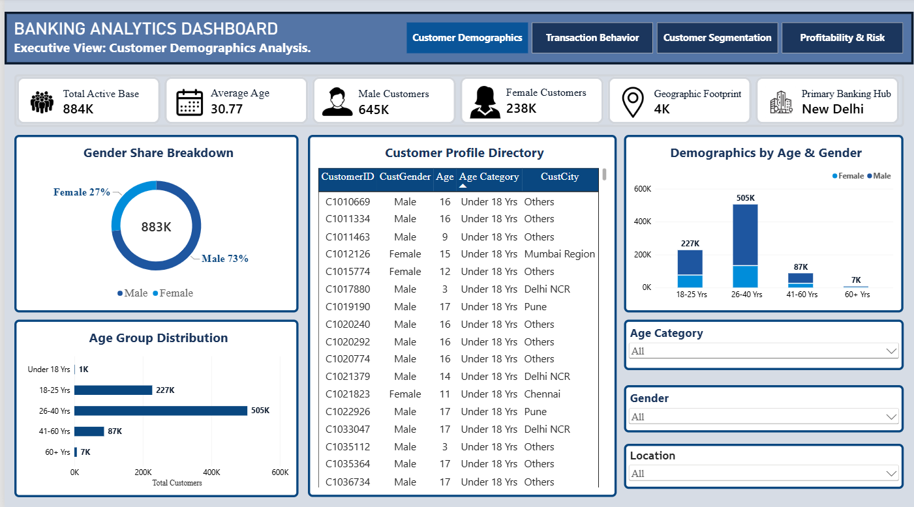
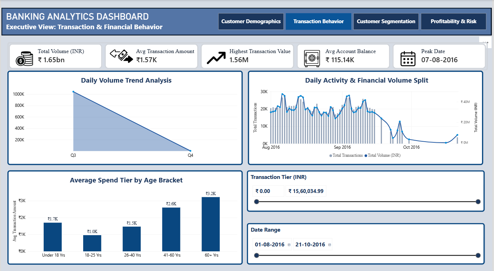
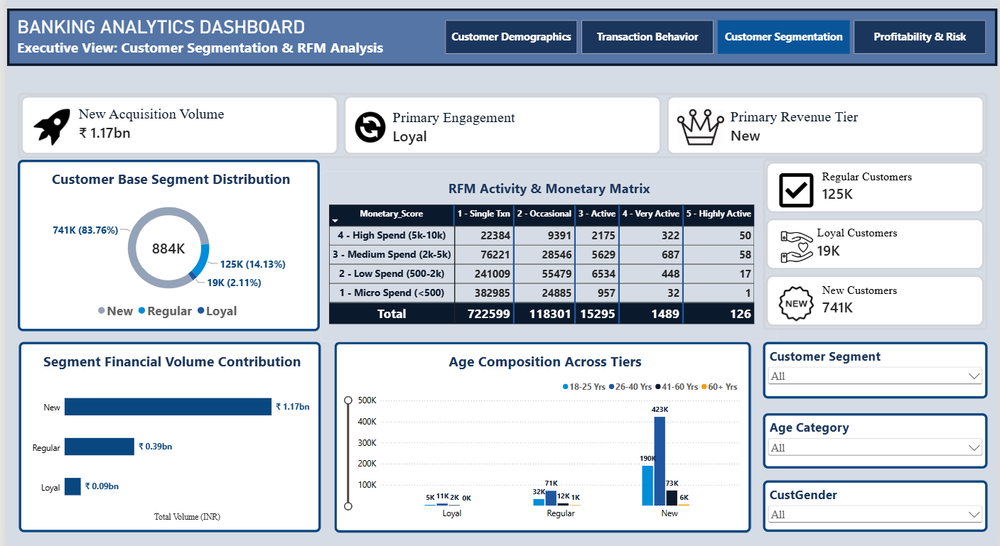
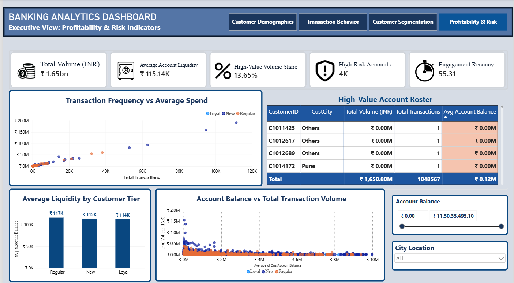
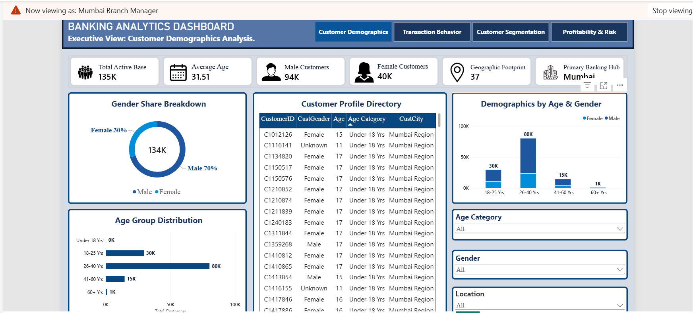

# 🏦 Banking Analytics & Executive Risk Dashboard

An executive-level, interactive 4-page Power BI analytics platform designed to evaluate customer demographics, transactional behavior, RFM-based customer segmentation, and financial risk indicators across regional banking branch networks.

---

## 📸 Dashboard Preview

### Page 1: Customer Demographics Analysis


### Page 2: Transaction & Financial Behavior


### Page 3: Customer Segmentation & RFM Matrix


### Page 4: Profitability & Risk Indicators


---

## 🔐 Row-Level Security (RLS) Governance

To comply with banking data privacy standards, static role-based access control (RLS) rules are configured on the data model to restrict regional branch managers strictly to their assigned territories.

### Enforced Regional View


### Security Scope Matrix

| Role Name | Scope / Filter Context | Target Territory Scope |
| :--- | :--- | :--- |
| **Executive_Admin** | Unrestricted Access | Global / All Regional Hubs |
| **Delhi Branch Manager** | `[CustCity] = "Delhi NCR"` | Delhi, Gurgaon, Noida, Faridabad |
| **Mumbai Branch Manager** | `[CustCity] = "Mumbai Region"` | Mumbai, Thane, Navi Mumbai |
| **Bengaluru Branch Manager** | `[CustCity] = "Bengaluru"` | Bengaluru Metropolitan Region |
| **Kolkata Branch Manager** | `[CustCity] = "Kolkata"` | Kolkata Metropolitan Region |
| **Chennai Branch Manager** | `[CustCity] = "Chennai"` | Chennai Region |
| **Pune Branch Manager** | `[CustCity] = "Pune"` | Pune Region |

---

## 📌 Executive Summary

This analytics dashboard equips senior banking executives and regional branch managers with operational visibility into customer portfolios, liquidity metrics, and transaction velocity.

### Key Functional Highlights
* **Demographic Footprint:** Age bracket breakdown, gender share distribution, and geographical footprint across major hubs.
* **Transaction Behavior:** Daily transaction volume trends, average spend tiers, and peak activity dates.
* **RFM Segmentation Matrix:** Quantitative scoring categorizing accounts into *New*, *Regular*, and *Loyal* cohorts.
* **Profitability & Risk Metrics:** Liquidity monitoring, high-value account rosters, and engagement recency analytics.

---

## 📂 Repository Structure

```text
banking-analytics-powerbi-dashboard/
├── assets/                  # Dashboard pages & RLS proof screenshots
│   ├── page1_demographics.png
│   ├── page2_behavior.png
│   ├── page3_segmentation.png
│   ├── page4_profitability.png
│   └── rls_filter_setup.png
├── dataset/                 # Raw source dataset
│   └── bank_analytics_raw_data.csv
├── Banking_Customer_Segmentation.pbix  # Main Power BI project file
└── README.md                # Project documentation
